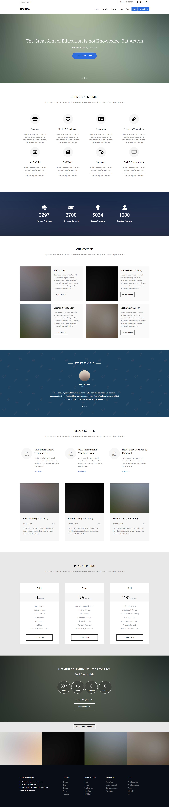

# Online Education Website

## Overview
Online class platform that student can register for the courses and the teacher can create a course. This website contains categories, courses, blog, plans section

## Technologies
- HTML5
- CSS3
- JavaScript ES6+

## Features
- **Page Navigation**
- **Revealing sections on scroll**
- **Slider**
- **Menu bar toggling**
- **Sticky navigation bar**
- **Date countdown**

## Screenshot

